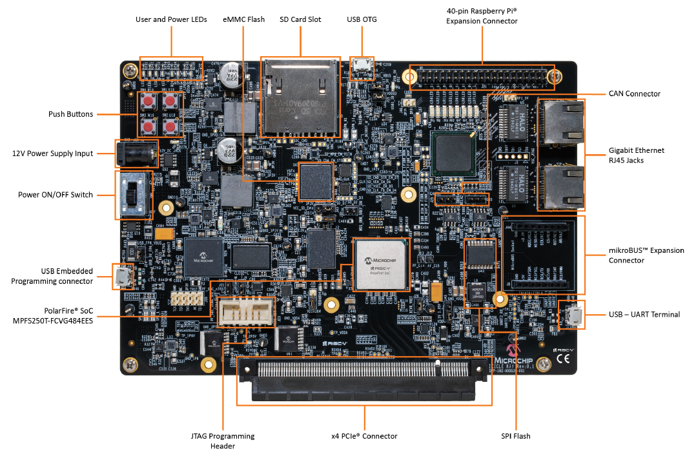
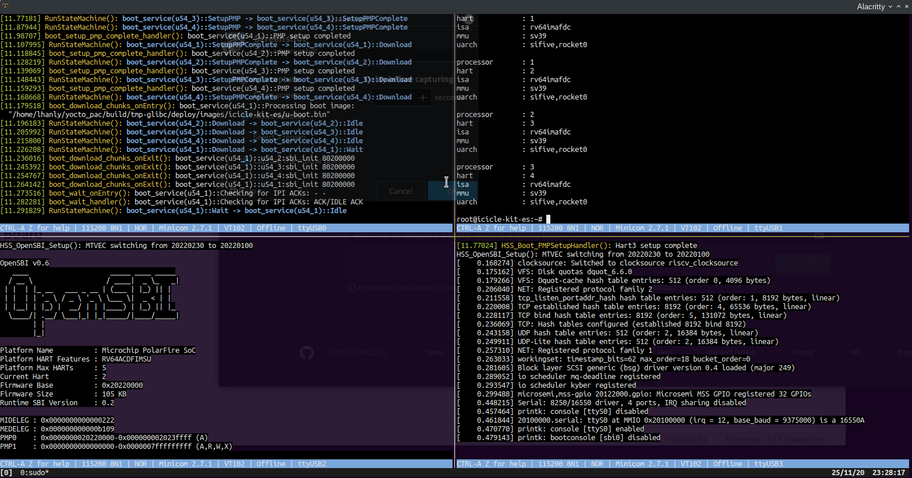

# 12-29-2020: Initial Setup of the PolarFire SOC Icicle Kit

## Introduction

I picked up the PolarFire SOC Icicle Kit during the crowd  funding phase on [Crowd Supply](https://www.crowdsupply.com/microchip/polarfire-soc-icicle-kit)
I've been playing around with the hardware off and on since I got it,




## Useful Links:

MicroChip Docs:

- [Icicle Kit Software Developer Guide](https://github.com/polarfire-soc/polarfire-soc-documentation/blob/master/boards/mpfs-icicle-kit-es/icicle-kit-sw-developer-guide/icicle-kit-sw-developer-guide.md)

- [Updating PolarFire SOC Icicle-Kit FPGA Design and Linux Image](https://github.com/polarfire-soc/polarfire-soc-documentation/blob/master/boards/mpfs-icicle-kit-es/updating-icicle-kit/updating-icicle-kit-design-and-linux.md)

seL4 Port:
- [seL4 on the PolarFire SOC](https://dornerworks.com/blog/sel4-on-polarfire-soc)

- [seL4 Test on the PolarFire SOC](https://dornerworks.com/microchip/polarfire-soc/sel4-test-instructions/)


## Script for terminal attach

After attaching with [minicom](https://en.wikipedia.org/wiki/Minicom) manually a few times,
I eventually found the script below, it comes from the [seL4 Test o the PolarFire SOC](https://dornerworks.com/microchip/polarfire-soc/sel4-test-instructions/)
documentation. It works pretty well, and uses [tio](https://github.com/tio/tio) (which I find
much more pleasant to work with) instead of **minicom**.

```bash
#!/bin/bash
tmux new-session -d -s 'polarfire-serial-dashboard'
tmux split-window -v
tmux split-window -h
tmux select-pane -t 0
tmux split-window -h
tmux respawn-pane -t0 -k "tio /dev/ttyUSB0"
tmux respawn-pane -t1 -k "tio /dev/ttyUSB1"
tmux respawn-pane -t2 -k "tio /dev/ttyUSB2"
tmux respawn-pane -t3 -k "tio /dev/ttyUSB3"
tmux select-layout tiled
tmux set -g mouse on
tmux attach-session -t 'polarfire-serial-dashboard'
```

I've also setup the scripts as a gist here: [PolarFire SOC Icicle Gists](https://gist.github.com/bgianfo/24a1623953a8d45cd72e918dd80510b3)

## First Boot

After getting everything figured out I was able to boot, attached to all of
the UART serial consoles attached, and interact with the linux login.




I was a little excited at this point, so I announced my accomplishment to the world: 

<blockquote class="twitter-tweet" data-theme="dark"><p lang="en" dir="ltr">Finally got around to playing with my Polarfire SoC Icicle Kit. Screenshot is minicom attached to all 4 (!) UART serial debug consoles. riscv64 running linux for now, want to play with the seL4 port though. Maybe an attempt to port <a href="https://twitter.com/hashtag/serenityos?src=hash&amp;ref_src=twsrc%5Etfw">#serenityos</a>? 😃 <a href="https://twitter.com/hashtag/riscv?src=hash&amp;ref_src=twsrc%5Etfw">#riscv</a> <a href="https://twitter.com/hashtag/polarfire?src=hash&amp;ref_src=twsrc%5Etfw">#polarfire</a> <a href="https://t.co/q9EF98NhF3">pic.twitter.com/q9EF98NhF3</a></p>&mdash; Brian Gianforcaro (@bgianf) <a href="https://twitter.com/bgianf/status/1331864239842070528?ref_src=twsrc%5Etfw">November 26, 2020</a></blockquote> <script async src="https://platform.twitter.com/widgets.js" charset="utf-8"></script> 
