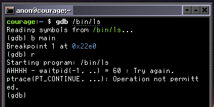
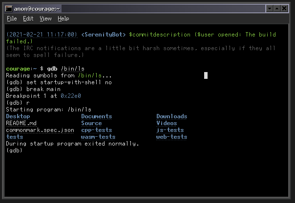

# Porting GDB to SerenityOS

## Summary

This is a living document that describes my process of porting GDB to SerenityOS.
The following changes have made it into the tree to support this work: 

- [X] [LibC: Stub out tcsendbreak(..) and tcdrain(..)](https://github.com/SerenityOS/serenity/commit/7828d4254e7707adcb9bf7190e5c3dc7a8a7d9de)
- [X] [Kernel: Return the actual number of CPU cores that we have](https://github.com/SerenityOS/serenity/commit/fcdd2027419607bed6b24a9ee364d6ad4cd99a41)
- [X] [Kernel: Signals galore][signals-galore] 
- [X] [Ports: Add initial GDB 11.1 port](https://github.com/SerenityOS/serenity/commit/bd3bbd032949642ab113058e6372de40af7f0b2c)
- [X] [LibC: Make regs.h work with compilers without concepts](https://github.com/SerenityOS/serenity/commit/1210ee9ba9b9a20346cb90e9e1baa92ee1f240d0)
- [X] [Ports/gdb: Fix compiler -fpermissive warnings from using latest GCC](https://github.com/SerenityOS/serenity/commit/6137b9f2725c7aee874ac9ef05c4bd23033f1a29)
- [X] [Ports/gdb: Add basic ptrace based native target for SerenityOS/i386](https://github.com/SerenityOS/serenity/commit/e308536005020bb03fd34304fd81e17716e620a9)
- [X] [Kernel: Set new process name in `do_exec` before waiting for the tracer](https://github.com/SerenityOS/serenity/commit/70f3fa2dd2d8923fbd683dda9048938629ac5044)
- [X] [Ports/gdb: Add descriptions to all gdb patches and remove dead code](https://github.com/SerenityOS/serenity/commit/f01e1d0c17caca18b6d4723bf7579a20395cb6cc)
- [X] [Ports/gdb: Implement wait and mourn_inferior overrides for our target](https://github.com/SerenityOS/serenity/commit/e56262caedb0a1dc3010bfd8209682aa7fde3356)
- [X] [Ports/gdb: Upgrade gdb to version 11.2](https://github.com/SerenityOS/serenity/commit/213df97b55f83889e405f84b294a1c754be4b184)

## Introduction

While working on SerenityOS over the past few years, one of the things I've missed
the most is a powerful debugger. For whatever reason [Andreas][kling] and most of the
other developers working on the system don't seem to be fans of using a debugger.
Now that I think about it, Andreas even has a video titled
["Why I don't use a debugger"][kling-no-debuggie] on his YouTube channel. 😁

[Itamar Shenhar][itamar-twitter] has been doing a bunch of work on Hack Studio,
and as part of that has implemented `ptrace(..)` and a basic debugger known as `sdb` (See [PR #1885][sdb-pr-initial]):

```sh
courage:~ $ sdb /bin/ls
Program is stopped at: 0x0bfae99d (Loader.so:ELF::DynamicLinker::linker_main() +0x5ed)

(sdb) help
Options:
cont - Continue execution
si - step to the next instruction
sl - step to the next source line
line - show the position of the current instruction in the source code
regs - Print registers
dis [number of instructions] - Print disassembly
bp <address/symbol/file:line> - Insert a breakpoint
bt - show backtrace for current thread
x <address> - examine dword in memory

(sdb) dis 1
    0x0bfae99d <+0>:
```

The debugger integration with `Hack Studio` and the standalone `sdb` debugger are great first passes at some
basic debugging infrastructure. During my time at Microsoft, I have learned to love the debugger for root
causing complicated systems level bugs and even learning how a complex program works, there's no better tool in my
opinion. I think I would be a lot more productive working on Serenity if I had a more powerful debugger,
like `gdb`.  That's when I decided to try porting the **GNU Project Debugger** to SerenityOS!

## Getting Things Compiling

The initial work to get the debugger to compile went smoothly. The work started in 

[PR #11278 - LibC+Ports: Add initial GDB 11.1 port][gdb-pr-initial].

#### Setting up the port script

The first task at hand was to create a script to automate the building of the port.
Serenity has it's own [ports system][ports] for describing how assets should be downloaded
and then subsequently unpackaged, and built. The initial version I arrive on looked
something like this:

```sh
#!/usr/bin/env -S bash ../.port_include.sh
port=gdb
version=11.1
useconfigure=true
configopts=("--target=${SERENITY_ARCH}-pc-serenity" "--with-sysroot=/" "--with-build-sysroot=${SERENITY_INSTALL_ROOT}" "--with-newlib" "--enable-languages=c,c++" "--disable-lto" "--disable-nls" "--enable-shared" "--enable-default-pie" "--enable-host-shared" "--enable-threads=posix")
files="https://ftpmirror.gnu.org/gnu/gdb/gdb-${version}.tar.xz gdb-${version}.tar.xz cccfcc407b20d343fb320d4a9a2110776dd3165118ffd41f4b1b162340333f94"
makeopts+=("all")
installopts=("DESTDIR=${SERENITY_INSTALL_ROOT}")
depends=("gmp" "binutils")
auth_type="sha256"

# We only have a stub of getrusage(..)
export ac_cv_func_getrusage=no

# We don't support the madvise options that are used.
export ac_cv_func_madvise=no
```

We can see this does a few things:
- Specifies what version of the gdb source to download and a sha256 hash to validate that `.tar.xz` package with.
- Specifies that the port expects us to run the `configure` script.
- Specifies the configure options, which are mostly about how to target serenity's headers and libs, and what options to enable or disable.
- Expresses a dependency on the `gmp` and `binutils` ports.


#### Missing Dependencies

The next step was to modify the gdb `configure` scripts to enlighten them about the platform triplets (`i386-pc-serenity`, `x86_64-pc-serenity`), 

```diff
diff --git a/bfd/config.bfd b/bfd/config.bfd
index 30087e3..11dc114 100644
--- a/bfd/config.bfd
+++ b/bfd/config.bfd
@@ -634,6 +634,11 @@ case "${targ}" in
     targ_selvecs=
     targ64_selvecs=x86_64_elf64_vec
     ;;
+  i[3-7]86-*-serenity*)
+    targ_defvec=i386_elf32_vec
+    targ_selvecs=
+    targ64_selvecs=x86_64_elf64_vec
+    ;;
 #ifdef BFD64
   x86_64-*-cloudabi*)
     targ_defvec=x86_64_elf64_cloudabi_vec
@@ -694,6 +699,10 @@ case "${targ}" in
     targ_selvecs=i386_elf32_vec
     want64=true
     ;;
+  x86_64-*-serenity*)
+    targ_defvec=x86_64_elf64_vec
+    want64=true
+    ;;
 #endif
   i[3-7]86-*-lynxos*)
     targ_defvec=i386_elf32_vec
```

With the triplets in place I was able to actually build some code. I quickly
found some pieces we were missing. One of them was `sigtimedwait()`, I [mentioned
it in the project's discord][discord-sigtimedwait] and it just so happened that
[Idan Horowitz][idanho] had recently worked on the signal handling subsystem in the Kernel offered to help me out.

```
bgianf — 12/11/2021
If anyone is interested in some kernel work,
I need sigtimedwait() for a port of GDB.
I'll get around to it if no one is interested...
but just thought I'd throw it out there in case someone is collecting yaks 

IdanHo — 12/11/2021
I just touched signal handling a bunch, so I'll try looking into it
```

I continued to work in parallel, but the next morning I woke up to a nice little
gift, Idan had sent out [Kernel+LibC: Signals galore][signals-galore] which included
support for `sigtimedwait()`!

The next issues I encountered  were the `pthread_sigmask` and the pthread signal APIs
that gdb can use. SerenityOS didn't implement these APIs at the time, but it was easy
enough to disable them to make progress as gdb appeared to have fallback mechanisms when
they were disabled. This ended up being a patch to the `configure` script:

```diff
diff --git a/gdbsupport/configure b/gdbsupport/configure
index a9dd02c..3c5bcf5 100755
--- a/gdbsupport/configure
+++ b/gdbsupport/configure
@@ -8934,7 +8934,7 @@ $as_echo "$gdb_cv_cxx_std_thread" >&6; }

     # This check must be here, while LIBS includes any necessary
     # threading library.
-    for ac_func in pthread_sigmask pthread_setname_np
+    for ac_func in pthread_setname_np
 do :
   as_ac_var=`$as_echo "ac_cv_func_$ac_func" | $as_tr_sh`
 ac_fn_cxx_check_func "$LINENO" "$ac_func" "$as_ac_var"
diff --git a/libiberty/configure b/libiberty/configure
index fffb91d..defc239 100755
--- a/libiberty/configure
+++ b/libiberty/configure
@@ -6478,7 +6478,9 @@ case "${host}" in
     $as_echo "#define HAVE_SYS_ERRLIST 1" >>confdefs.h

     $as_echo "#define HAVE_SYS_NERR 1" >>confdefs.h
-
+    ;;
+  *-*-serenity*)
+    $as_echo "#define HAVE_PSIGNAL 1" >>confdefs.h
     ;;
 esac
```

The last thing holding us back from successfully compiling + linking gdb was that SerenityOS didn't implement `tcsendbreak(..)`
or `tcdrain(..)`. I stubbed these calls to return error and set `errno = ENOTSUP`.
After putting all of these changes together, I had a basic gdb build successfully compiling!

#### GDB Enlightenment

Now that we had gdb building, we could move on to the actual meat of the problem. How do we enlighten the debugger
to know about SerenityOS as a platform?

Looking at the gdb source, there is a pattern of having a few different files:
  -  `<os>-nat.c`
  -  `<architecture>-<os>-nat.c`
  -  `<os>-tdep.c`
  -  `<architecture>-<os>-tdep.c`

Here are the files for FreeBSD for example:

```
~/src/serenity/Ports/gdb/gdb-11.2/gdb$ ls *fbsd*.c
aarch64-fbsd-nat.c   arm-fbsd-tdep.c   mips-fbsd-nat.c	 riscv-fbsd-tdep.c
aarch64-fbsd-tdep.c  fbsd-nat.c        mips-fbsd-tdep.c  sparc64-fbsd-nat.c
amd64-fbsd-nat.c     fbsd-tdep.c       ppc-fbsd-nat.c	 sparc64-fbsd-tdep.c
amd64-fbsd-tdep.c    i386-fbsd-nat.c   ppc-fbsd-tdep.c
arm-fbsd-nat.c	     i386-fbsd-tdep.c  riscv-fbsd-nat.c
```

After reading some code the pattern seems to be that gdb places "target-dependent code"
in the `-tdep.c` files, and "native-dependent code" in the `-nat.c` files.
I also saw that there appears to be a generic `ptrace()` based target that a few other
operating systems derive from. In the source it's called `inf_ptrace_target`.
As I mentioned at the beginning of this post, serenity has basic ptrace support, so reusing
the ptrace inferior target sounded like a good initial game plane.

After hacking around for a while on and off I eventually had a basic target which should
theoretically allow us to use gdb to ptrace a serenity program. The broad strokes included:

- Deciding to target Serenity on i386/i686 to start, amd64 will follow later.
- Hooking up our new files to build when targeting SerenityOS.
- Mapping Serenity's layout of i386 CPU registers to gdb's.
- Adding a new `i386_serenity_nat_target` devied from `serenity_nat_target`.
- Adding a new OS ABI in gdb for SerenityOS
- Adding initialization routines to our new target and OS ABI with gdb at runtime. 

The initial version looked something like this, it was later cleaned up as [Ports/gdb: Add basic ptrace based native target for SerenityOS/i386](https://github.com/SerenityOS/serenity/commit/e308536005020bb03fd34304fd81e17716e620a9):
```diff
diff --git a/gdb/configure.nat b/gdb/configure.nat
index e34cccf..38b687e 100644
--- a/gdb/configure.nat
+++ b/gdb/configure.nat
@@ -86,6 +86,9 @@ case ${gdb_host} in
     darwin)
 	NATDEPFILES='fork-child.o nat/fork-inferior.o darwin-nat.o \
 	    darwin-nat-info.o'
+    ;;
+    serenity)
+	NATDEPFILES='fork-child.o nat/fork-inferior.o inf-ptrace.o'
 	;;
     sol2)
 	NATDEPFILES='fork-child.o nat/fork-inferior.o \
@@ -477,6 +480,14 @@ case ${gdb_host} in
 		;;
 	esac
 	;;
+    serenity)
+	case ${gdb_host_cpu} in
+	    i386)
+		# Host: SerenityOS/x86_64 ELF
+		NATDEPFILES="${NATDEPFILES} amd64-nat.o serenity-nat.o i386-serenity-nat.o"
+		;;
+	esac
+	;;
     sol2)
 	case ${gdb_host_cpu} in
 	    i386)
diff --git a/gdb/configure.tgt b/gdb/configure.tgt
index 97a5a57..886542f 100644
--- a/gdb/configure.tgt
+++ b/gdb/configure.tgt
@@ -291,6 +291,10 @@ i[34567]86-*-nto*)
 	gdb_target_obs="solib-svr4.o \
 			i386-nto-tdep.o nto-tdep.o"
 	;;
+i[34567]86-*-serenity*)
+	# Target: SerenityOS/i386
+	gdb_target_obs="i386-serenity-tdep.o serenity-tdep.o"
+	;;
 i[34567]86-*-solaris2* | x86_64-*-solaris2*)
 	# Target: Solaris x86_64
 	gdb_target_obs="${i386_tobjs} ${amd64_tobjs} \

diff --git a/gdb/i386-serenity-nat.c b/gdb/i386-serenity-nat.c
new file mode 100644
index 0000000..034252a
--- /dev/null
+++ b/gdb/i386-serenity-nat.c
@@ -0,0 +1,101 @@
+/* Native-dependent code for SerenityOS/i386. */
+
+#include "defs.h"
+#include "gdbcore.h"
+#include "regcache.h"
+#include "regset.h"
+#include "target.h"
+
+#include <sys/arch/i386/regs.h>
+#include <sys/ptrace.h>
+
+#include "i386-tdep.h"
+#include "serenity-nat.h"
+
+/* Register maps.  */
+
+static const struct regcache_map_entry i386_serenity_gregmap[] =
+{
+    { 1, I386_EAX_REGNUM, 0 }, 
+    { 1, I386_ECX_REGNUM, 0 }, 
+    { 1, I386_EDX_REGNUM, 0 }, 
+    { 1, I386_EBX_REGNUM, 0 }, 
+    { 1, I386_ESP_REGNUM, 0 }, 
+    { 1, I386_EBP_REGNUM, 0 }, 
+    { 1, I386_ESI_REGNUM, 0 }, 
+    { 1, I386_EDI_REGNUM, 0 }, 
+    { 1, I386_EIP_REGNUM, 0 }, 
+    { 1, I386_EFLAGS_REGNUM, 0 }, 
+    { 1, I386_CS_REGNUM, 0 }, 
+    { 1, I386_SS_REGNUM, 0 }, 
+    { 1, I386_DS_REGNUM, 0 }, 
+    { 1, I386_ES_REGNUM, 0 }, 
+    { 1, I386_FS_REGNUM, 0 }, 
+    { 1, I386_GS_REGNUM, 0 }, 
+    { 0 },
+};
+
+const struct regset i386_serenity_gregset =
+{
+    i386_serenity_gregmap, regcache_supply_regset, regcache_collect_regset
+};
+
+class i386_serenity_nat_target final : public serenity_nat_target
+{
+  void fetch_registers (struct regcache* cache, int regnum) override
+  {
+    if (regnum == -1) {
+      pid_t pid = get_ptrace_pid (cache->ptid ());
+      PtraceRegisters regs;
+
+      if (ptrace (PT_GETREGS, pid, &regs, 0) == -1)
+        perror_with_name (_("Couldn't get registers"));
+
+      cache->supply_regset (&i386_serenity_gregset, regnum, &regs,
+              sizeof (regs));
+    }
+  };
+
+  void store_registers (struct regcache* cache, int regnum) override
+  {
+    if (regnum == -1) {
+      pid_t pid = get_ptrace_pid (cache->ptid ());
+      PtraceRegisters regs {};
+
+      if (ptrace (PT_GETREGS, pid, (PTRACE_TYPE_ARG3) &regs, 0) == -1)
+        perror_with_name (_("Couldn't get registers"));
+
+      cache->collect_regset (&i386_serenity_gregset, regnum, &regs,
+			       sizeof (regs));
+
+      if (ptrace (PT_SETREGS, pid, (PTRACE_TYPE_ARG3) &regs, 0) == -1)
+        perror_with_name (_("Couldn't write registers"));
+    }
+  };
+};
+
+static i386_serenity_nat_target the_i386_serenity_nat_target;
+
+void _initialize_i386_serenity_nat ();
+void
+_initialize_i386_serenity_nat ()
+{
+  add_inf_child_target (&the_i386_serenity_nat_target);
+}

diff --git a/gdb/i386-serenity-tdep.c b/gdb/i386-serenity-tdep.c
new file mode 100644
index 0000000..d384061
--- /dev/null
+++ b/gdb/i386-serenity-tdep.c
@@ -0,0 +1,27 @@
+/* Target-dependent code for SerenityOS/i386. */
+
+#include "defs.h"
+#include "arch-utils.h"
+#include "gdbcore.h"
+#include "osabi.h"
+#include "regcache.h"
+
+/* Implement the 'init_osabi' method of struct gdb_osabi_handler.  */
+static void
+i386_serenity_init_abi (struct gdbarch_info info, struct gdbarch *gdbarch)
+{
+  /* Generic SerenityOS support.  */
+  serenity_init_abi (info, gdbarch);
+}
+
+void _initialize_i386_serenity_tdep ();
+void
+_initialize_i386_serenity_tdep ()
+{
+  gdbarch_register_osabi (bfd_arch_i386, 0, GDB_OSABI_SERENITYOS,
+			  i386_serenity_init_abi);
+}

diff --git a/gdb/osabi.c b/gdb/osabi.c
index aabf895..28789e8 100644
--- a/gdb/osabi.c
+++ b/gdb/osabi.c
@@ -82,6 +82,7 @@ static const struct osabi_names gdb_osabi_names[] =
   { "Newlib", NULL },
   { "SDE", NULL },
   { "PikeOS", NULL },
+  { "SerenityOS", NULL },

   { "<invalid>", NULL }
 };

diff --git a/gdb/osabi.h b/gdb/osabi.h
index 1ecbed4..73c5549 100644
--- a/gdb/osabi.h
+++ b/gdb/osabi.h
@@ -46,6 +46,7 @@ enum gdb_osabi
   GDB_OSABI_NEWLIB,
   GDB_OSABI_SDE,
   GDB_OSABI_PIKEOS,
+  GDB_OSABI_SERENITYOS,

   GDB_OSABI_INVALID		/* keep this last */
 };

diff --git a/gdb/serenity-nat.c b/gdb/serenity-nat.c
new file mode 100644
index 0000000..ff740d4
--- /dev/null
+++ b/gdb/serenity-nat.c
@@ -0,0 +1,13 @@
+/* Native-dependent code for SerenityOS  */
+
+#include "defs.h"
+#include "gdbthread.h"
+#include "inferior.h"
+#include "target.h"
+
+#include <sys/types.h>
+#include <sys/ptrace.h>
+#include "gdbsupport/gdb_wait.h"
+
+#include "inf-child.h"
+#include "serenity-nat.h"

diff --git a/gdb/serenity-nat.h b/gdb/serenity-nat.h
new file mode 100644
index 0000000..ac3cfaa
--- /dev/null
+++ b/gdb/serenity-nat.h
@@ -0,0 +1,34 @@
+/* Native-dependent code for SerenityOS.  */
+
+#ifndef SERENITYOS_NAT_H
+#define SERENITYOS_NAT_H
+
+#include "inf-ptrace.h"
+
+/* A prototype generic Serenity target.
+   A concrete instance should override it with local methods. 
+*/
+
+class serenity_nat_target : public inf_ptrace_target
+{
+};
+
+#endif /* serenity-nat.h */
```

Once I tried to get this compiling I ran into a funny issue with SerenityOS's LibC and `ptrace()` implementation.
The implementation exposes registers via a struct `PtraceRegisters`, which assumed that everything that would ever use
it would also be using the SerenityOS AK[^ak-footnote] library, so it pulled in private types. As you can imagine this caused
a few problems as the gdb code has no idea about these types, and we were leaking implementation details from our LibC to a random software port.
This was easy enough to fix, we just needed to avoid using Serenity specific types and defining C++ functions via this C ABI.
The diff is a bit boring, so I won't include the whole thing here 😁. 
After this change to LibC we were back in business and our new serenity target was compiling.

Commit Link: [LibC: Make regs.h work with compilers without concepts](https://github.com/SerenityOS/serenity/commit/1210ee9ba9b9a20346cb90e9e1baa92ee1f240d0)

## Testing & Debugging

At this stage we had gdb compiling, and it had the basic knowledge about the serenity platform.
I posted a draft PR and posted [a message in the SerenityOS discord](https://discord.com/channels/830522505605283862/830807158047244329/921021879291101184)
letting folks know I had made some progress.
It was a very late for be a this point, so was headed for bed.
[Daniel Bertalan](https://github.com/BertalanD), another SerenityOS contributor, [noticed and decided to dig in](https://discord.com/channels/830522505605283862/830807158047244329/921021950896271420) while I was catching some Z's.

Daniel and Idan (who had contributed to the effort before) both ended up tracking down two bug:
  - Commit Link: [Kernel: Return the actual number of CPU cores that we have](https://github.com/SerenityOS/serenity/commit/fcdd2027419607bed6b24a9ee364d6ad4cd99a41)
  - Commit Link: [Ports/gdb: Use mmap instead of malloc for sigaltstack()](https://github.com/SerenityOS/serenity/pull/11278/commits/0b00ec7498dee5d704b3f682ecdc2b580e3b33f8)


The first kernel bug Daniel found was pretty straight forward, we were returning max size of the data structure, and not 
the actual count of processors on the system, which caused gdb to spawn a huge number of threads for now reason.

```diff
From: Daniel Bertalan <dani@danielbertalan.dev>
Date: Thu, 16 Dec 2021 18:11:25 +0100
Subject: [PATCH] Kernel: Return the actual number of CPU cores that we have

... instead of returning the maximum number of Processor objects that we
can allocate.

Some ports (e.g. gdb) rely on this information to determine the number
of worker threads to spawn. When gdb spawned 64 threads, the kernel
could not cope with generating backtraces for it, which prevented us
from debugging it properly.

This commit also removes the confusingly named
`Processor::processor_count` function so that this mistake can't happen
again.
---
 Kernel/Arch/x86/Processor.h | 2 --
 Kernel/Syscalls/sysconf.cpp | 2 +-
 2 files changed, 1 insertion(+), 3 deletions(-)

diff --git a/Kernel/Arch/x86/Processor.h b/Kernel/Arch/x86/Processor.h
index c2f91e177311d..cd3962a9c2f44 100644
--- a/Kernel/Arch/x86/Processor.h
+++ b/Kernel/Arch/x86/Processor.h
@@ -170,8 +170,6 @@ class Processor {
     void flush_gdt();
     const DescriptorTablePointer& get_gdtr();
 
-    static size_t processor_count() { return processors().size(); }
-
     template<IteratorFunction<Processor&> Callback>
     static inline IterationDecision for_each(Callback callback)
     {
diff --git a/Kernel/Syscalls/sysconf.cpp b/Kernel/Syscalls/sysconf.cpp
index ce6b649480c6a..b7a82d73d41e5 100644
--- a/Kernel/Syscalls/sysconf.cpp
+++ b/Kernel/Syscalls/sysconf.cpp
@@ -18,7 +18,7 @@ ErrorOr<FlatPtr> Process::sys$sysconf(int name)
         return 1;
     case _SC_NPROCESSORS_CONF:
     case _SC_NPROCESSORS_ONLN:
-        return Processor::processor_count();
+        return Processor::count();
     case _SC_OPEN_MAX:
         return OpenFileDescriptions::max_open();
     case _SC_PAGESIZE:
```

The second issue was trickier, Daniel and Idan were seeing [a crash in our LibC free() on gdb startup](https://discord.com/channels/830522505605283862/834391539425476680/921093384746188810)
when gdb was attempting to allocate an alternate signal stack.
They eventually root caused the issue to an incompatibility between the SerenityOS memory manager and gdb's assumptions.
They were able to work around the issue by just `mmap()`ing the alternative signal stack directly, instead of going through malloc.

```diff
From: Daniel Bertalan <dani@danielbertalan.dev>
Date: Thu, 16 Dec 2021 19:20:45 +0100
Subject: [PATCH] Ports/gdb: Use mmap instead of malloc for sigaltstack()

Stack regions can't be made volatile, which makes it impossible for
malloc to manage memory that's used for `sigaltstack()`. Let's use mmap
instead.

Co-authored-by: Idan Horowitz <idan.horowitz@gmail.com>
---
 Ports/gdb/patches/alt-stack-no-malloc.patch | 70 +++++++++++++++++++++
 1 file changed, 70 insertions(+)
 create mode 100644 Ports/gdb/patches/alt-stack-no-malloc.patch

diff --git a/Ports/gdb/patches/alt-stack-no-malloc.patch b/Ports/gdb/patches/alt-stack-no-malloc.patch
new file mode 100644
index 0000000000000..974d1db061a54
--- /dev/null
+++ b/Ports/gdb/patches/alt-stack-no-malloc.patch
@@ -0,0 +1,70 @@
+diff --git a/gdbsupport/alt-stack.h b/gdbsupport/alt-stack.h
+index 056ea41..b638533 100644
+--- a/gdbsupport/alt-stack.h
++++ b/gdbsupport/alt-stack.h
+@@ -20,7 +20,9 @@
+ #ifndef GDBSUPPORT_ALT_STACK_H
+ #define GDBSUPPORT_ALT_STACK_H
+ 
++#include "common-defs.h"
+ #include <signal.h>
++#include <sys/mman.h>
+ 
+ namespace gdb
+ {
+@@ -36,31 +38,44 @@ class alternate_signal_stack
+ public:
+   alternate_signal_stack ()
+   {
++    // We can't use xmalloc here on Serenity, because stack regions
++    // do not play well with how malloc manages its memory.
+ #ifdef HAVE_SIGALTSTACK
+-    m_stack.reset ((char *) xmalloc (SIGSTKSZ));
+-
+-    stack_t stack;
+-    stack.ss_sp = m_stack.get ();
+-    stack.ss_size = SIGSTKSZ;
+-    stack.ss_flags = 0;
+-
+-    sigaltstack (&stack, &m_old_stack);
++    void *ptr = mmap (nullptr, SIGSTKSZ, PROT_READ | PROT_WRITE,
++                      MAP_PRIVATE | MAP_ANONYMOUS, -1, 0);
++    if (ptr == MAP_FAILED)
++      {
++        warning ("could not mmap alternate signal stack");
++      }
++    else
++      {
++        m_stack = ptr;
++        stack_t stack;
++        stack.ss_sp = m_stack;
++        stack.ss_size = SIGSTKSZ;
++        stack.ss_flags = 0;
++
++        sigaltstack (&stack, &m_old_stack);
++      }
+ #endif
+   }
+ 
+   ~alternate_signal_stack ()
+   {
+ #ifdef HAVE_SIGALTSTACK
+-    sigaltstack (&m_old_stack, nullptr);
++    if (m_stack != nullptr)
++      {
++        sigaltstack (&m_old_stack, nullptr);
++        munmap (m_stack, SIGSTKSZ);
++      }
+ #endif
+   }
+ 
+   DISABLE_COPY_AND_ASSIGN (alternate_signal_stack);
+ 
+ private:
+-
+ #ifdef HAVE_SIGALTSTACK
+-  gdb::unique_xmalloc_ptr<char> m_stack;
++  void *m_stack{ nullptr };
+   stack_t m_old_stack;
+ #endif
+ };
```


I woke up to discover this awesome progress, and was eager to see how far gdb would make it.
I launched `gdb` on the system, it immediately appeared to hang.
Since I did not have a working debugger, I just used the Serenity Profiler to see where the code
was spinning. [I was able to narrow down the problem](https://discord.com/channels/830522505605283862/830739873119207426/921857643348369418) to gdb not gracefully handling the `tcdrain(..)` or `tcsendbreak(..)` failure.
These were the same functions I stubbed out earlier in Serenity's LibC, so they always return failure.
Returning an error here was causing `gdb` to just spin trying to call it over and over again.
Fortunately, we did not have to worry about supporting real terminals, only pseudo terminals, so just changing
the implementation to do nothing but claim success was sufficient for our purposes.
Commit Link: [LibC: Stub out tcsendbreak(..) and tcdrain()][libc-stubs]:


Much to my surprise, we could see real signs of life after squashing those bugs:


gdb is now able to startup and make progress actually towards launching and attaching to `ls`, but `ls` doesn't seem to actually run,
when we attempt to launch the application it appears to hang after launch. 

## Bridging gdb and Serenity

With the kernel bug fix, I had a better picture of what was going on, it looked like we had a bug
with how the serenity target was interacting with the Serenity kernel's ptrace() implementation.

After reading the gdb ptrace code and adding a variety of trace points, I finally got a feeling for
how the gdb `ptrace` target expected things to work.  The flow is supposed to look like this:

1. Debugger calls `fork()`
2. The forked child calls ptrace() with `PT_TRACE_ME`
3. The `PT_TRACE_ME` instructs the forked process to block in the
   kernel waiting for a signal from the tracer on the next call
   to `execve(..)`. This puts the child in "Stopped" state.
4. Debugger waits for forked child to spawn and stop, and then it
   and will resume the child by calling ptrace() with `PT_CONTINUE`.

The first thing that I found with my logging was that the gdb `inf_ptrace_target::wait` implementation
was getting stuck on step 4, calling `waitpid()` on child process it previously forked. Instead of returning we were
spinning in this busy loop trying to wait for the child. Ever call to `waitpid()` seemed
to be failing.

```c++
/* Wait for the child specified by PTID to do something.  Return the
   process ID of the child, or MINUS_ONE_PTID in case of error; store
   the status in *OURSTATUS.  */

ptid_t
inf_ptrace_target::wait (ptid_t ptid, struct target_waitstatus *ourstatus,
                         target_wait_flags target_options)
{ pid_t pid;
  int options, status, save_errno;

  options = 0;
  if (target_options & TARGET_WNOHANG)
    options |= WNOHANG;

  do
    {
      set_sigint_trap ();

      do
        {
          pid = waitpid (ptid.pid (), &status, options);
          save_errno = errno;
        }
      while (pid == -1 && errno == EINTR);
```

To figure out why this could be happening I looked at the code that handled `waitpid()` in
the SerenityOS Kernel, and found the [following morsel of information](https://github.com/SerenityOS/serenity/blob/086969277e74d8ba065bf8145d3aeb0dec0bfee5/Kernel/ThreadBlockers.cpp#L733).
The implementation will fail if you attempt to wait on a stopped process, but don't pass `WSTOPPED`, or `WUNTRACED` (which are defined in terms of one another).
So we just need to pass `WSTOPPED` to our `waitpid()` call!

```cpp
bool Thread::WaitBlocker::unblock(
    Process& process, UnblockFlags flags, u8 signal, bool from_add_blocker)
{
    ... snip ...

    if (do_not_unblock)
        return false;

    switch (flags) {
    case UnblockFlags::Terminated:
        if (!(m_wait_options & WEXITED))
            return false;
        break;
    case UnblockFlags::Stopped:
        if (!(m_wait_options & WSTOPPED))    // <== HERE!
            return false;
        if (!(m_wait_options & WUNTRACED) && !process.is_traced())
            return false;
        break;

```

I was able to override the `inf_ptrace_target::wait` implementation in our `serenity_nat_target` derived class.
So we always pass in `WSTOPPED` to the `waitpid()` operation, and I added a bit more error logging, which would
have helped me figure this out faster.

```cpp
ptid_t serenity_nat_target::wait(
    ptid_t ptid, struct target_waitstatus* ourstatus, target_wait_flags)
{
    int pid;
    int status, save_errno;

    do
    {
        set_sigint_trap ();

        do
        {
            errno = 0;
            pid = waitpid (ptid.pid (), &status, WSTOPPED);
            if (errno != 0)
            {
                save_errno = errno;
                perror_with_name (("waitpid"));
            }
        }
        while (pid == -1 && (save_errno == EINTR || save_errno == EAGAIN));
```

With that fixed, I moved on to try to the next issue.
Now that we successfully waited for process to startup, the logging I had added earlier was telling me that `ptrace(PT_CONTINUE, ...)` 
was failing after the wait.



Going through the ptrace code in the kernel, I realized that the Serenity implementation of ptrace expects
the caller to always call `ptrace(PT_ATTACH, ...)` before `ptrace(PT_CONTINUE, ...)` otherwise it will fail.

We can see the that we will return `EPERM` (Operation not permitted) if we don't
have a trace setup, before we get to the `PT_CONTINUE` handler. We setup the tracer
only in the code path where `params.request == PT_ATTACH`.

```cpp
static ErrorOr<FlatPtr> handle_ptrace(
    Kernel::Syscall::SC_ptrace_params const& params, Process& caller)
{
    ... snip ...

    auto peer = Thread::from_tid(params.tid);
    if (!peer)
        return ESRCH;

    MutexLocker ptrace_locker(peer->process().ptrace_lock());

    if ((peer->process().uid() != caller.euid())
        || (peer->process().uid() != peer->process().euid()))
        return EACCES;

    if (!peer->process().is_dumpable())
        return EACCES;

    auto& peer_process = peer->process();
    if (params.request == PT_ATTACH) {      // <============== PT_ATTACH CASE!
        if (peer_process.tracer()) {
            return EBUSY;
        }
        TRY(peer_process.start_tracing_from(caller.pid()));
        SpinlockLocker lock(peer->get_lock());
        if (peer->state() != Thread::State::Stopped) {
            peer->send_signal(SIGSTOP, &caller);
        }
        return 0;
    }

    auto* tracer = peer_process.tracer();

    if (!tracer)
        return EPERM;                        // <============== ERROR CASE!

    if (tracer->tracer_pid() != caller.pid())
        return EBUSY;

    if (peer->state() == Thread::State::Running)
        return EBUSY;

    scheduler_lock.unlock();

    switch (params.request) {
    case PT_CONTINUE:
        peer->send_signal(SIGCONT, &caller);
        break;
```

This implementation differs a bit from `ptrace()` implementations on
other unix like systems, so gdb doesn't actually have a place for us to hook into
the setup of the debugger target to make our call to `ptrace(PT_ATTACH, ...)`.
To workaround this, we can (ab)use the `serenity_nat_target::wait` hook that we
already extended. We can inject our ptrace call only if we think the process has
just started up.

```cpp
/* Serenity requires us to PT_ATTACH before we PT_CONTINUE, however GDB doesn't
 * provide a hook for us to do that before we issue the PT_CONTINUE, so we are
 * forced to do it here.
 */
if (!m_attach_before_continue_called) {
    errno = 0;
    ptrace (PT_ATTACH, pid, (PTRACE_TYPE_ARG3)0, 0);
    if (errno != 0) {
        save_errno = errno;
        printf_unfiltered (_("PT_ATTACH failed: %d - %s \n"), 
            save_errno, safe_strerror (save_errno));
    }
    m_attach_before_continue_called = true;
}
```

There was one final bug here that I was able to quickly fix. 
After the process we are debugging finished executing, we would hang waiting
for it to terminate. This ended up being another serenity peculiarity, where
we needed to pass `WNOHANG` to `waitpid()` otherwise the call would wait forever.
The fix ended up being another override of the `inf_ptrace_target` implementation:

```cpp
void serenity_nat_target::mourn_inferior ()
{
    int status;
    waitpid (inferior_ptid.pid (), &status, WNOHANG);

    inf_child_target::mourn_inferior ();
}
```

All of these fixes were collected and sent out in the following pull request.
[Ports/gdb: Implement wait and mourn_inferior overrides for our target](https://github.com/SerenityOS/serenity/pull/12676)
With all of these change we are able to run a program under the debugger! 🥳




We launched `/bin/ls` under gdb, it ran, and was able to write it's output to
`stdout` and it exited and gdb was able to observe that. Unfortunately the
breakpoint we set did not hit in this case, but that's a bug for later! We have
to take some time to celebrate. 🎉

## Bonus Bug: Kernel Process Name after `PT_TRACE_ME`

In the middle of debugging the issues with `waitpid()` and `ptrace()` mentioned above,
I actually took a small detour after I noticed another bug.
While trouble shooting I noticed was that there were two processes named `gdb` in the `System Monitor`.
One was sitting in `Stopped` state, and one sitting in `Selecting`[^selecting-footnote] state.


This doesn't make any sense, why is gdb launching two processes, and why is it hanging waiting for itself?
I quickly hacked up some logging to the ptrace implementation in the Kernel to let me see what was happening.

```diff
diff --git a/Kernel/Syscalls/ptrace.cpp b/Kernel/Syscalls/ptrace.cpp
index 26d5d92e71..016007f97f 100644
--- a/Kernel/Syscalls/ptrace.cpp
+++ b/Kernel/Syscalls/ptrace.cpp
@@ -20,6 +20,7 @@ static ErrorOr<FlatPtr> handle_ptrace(const Kernel::Syscall::SC_ptrace_params& p
 {
     SpinlockLocker scheduler_lock(g_scheduler_lock);
     if (params.request == PT_TRACE_ME) {
+        dbgln("PT_TRACE_ME - caller({}) ", caller.pid());
         if (Process::current().tracer())
             return EBUSY;

@@ -49,6 +50,7 @@ static ErrorOr<FlatPtr> handle_ptrace(const Kernel::Syscall::SC_ptrace_params& p

     auto& peer_process = peer->process();
     if (params.request == PT_ATTACH) {
+        dbgln("PT_ATTACH - peer({}) caller({}) ", peer_process.pid(), caller.pid());
         if (peer_process.tracer()) {
             return EBUSY;
         }
@@ -62,8 +64,10 @@ static ErrorOr<FlatPtr> handle_ptrace(const Kernel::Syscall::SC_ptrace_params& p

     auto* tracer = peer_process.tracer();

-    if (!tracer)
+    if (!tracer) {
+        dbgln("ptrace - peer({}) has no tracer!", peer_process.pid());
         return EPERM;
+    }

     if (tracer->tracer_pid() != caller.pid())
         return EBUSY;
@@ -75,20 +79,24 @@ static ErrorOr<FlatPtr> handle_ptrace(const Kernel::Syscall::SC_ptrace_params& p

     switch (params.request) {
     case PT_CONTINUE:
+        dbgln("PT_CONTINUE - peer({}) caller({}) ", peer_process.pid(), caller.pid());
         peer->send_signal(SIGCONT, &caller);
         break;

     case PT_DETACH:
+        dbgln("PT_DETACH - peer({}) caller({}) ", peer_process.pid(), caller.pid());
         peer_process.stop_tracing();
         peer->send_signal(SIGCONT, &caller);
         break;
```

Re-running `gdb /bin/ls` with the logging active in the kernel we now see the
following output:

```
249.269 [#0 gdb(51:51)]: PT_TRACE_ME - caller(51)
249.273 [#0 gdb(49:49)]: PT_ATTACH - peer(51) caller(49)
249.273 [#0 gdb(49:49)]: PT_CONTINUE - peer(51) caller(49)
249.278 [#0 gdb(51:51)]: signal: SIGCONT resuming gdb(51:51)
```

The logging output gives us a clue, we appear to be properly forking and calling
ptrace correctly, however the name of the process appears to be incorrect in the
kernel? 

After some digging around in the code, the issue turned out to be the location
where we were updating the process name in `execve(..)` had a very minor bug
which caused the process name to be incorrect. The fix was trivial, it can be
found here: [Kernel: Set new process name in do_exec before waiting for the tracer](https://github.com/SerenityOS/serenity/pull/12464).

The commit message itself provides a nice description of the interaction between
`fork()`, `ptrace()` and `execve(..)` that are involved here: 

```diff
From: Brian Gianforcaro <bgianf@serenityos.org>
Date: Sat, 12 Feb 2022 08:17:42 -0800
Subject: [PATCH] Kernel: Set new process name in `do_exec` before waiting for
 the tracer

While investigating why gdb is failing when it calls `PT_CONTINUE`
against Serenity I noticed that the names of the programs in the
System Monitor didn't make sense. They were seemingly stale.

After inspecting the kernel code, it became apparent that the sequence
occurs as follows:

    1. Debugger calls `fork()`
    2. The forked child calls `PT_TRACE_ME`
    3. The `PT_TRACE_ME` instructs the forked process to block in the
       kernel waiting for a signal from the tracer on the next call
       to `execve(..)`.
    4. Debugger waits for forked child to spawn and stop, and then it
       calls `PT_ATTACH` followed by `PT_CONTINUE` on the child.
    5. Currently the `PT_CONTINUE` fails because of some other yet to
       be found bug.
    6. The process name is set immediately AFTER we are woken up by
       the `PT_CONTINUE` which never happens in the case I'm debugging.

This chain of events leaves the process suspended, with the name  of
the original (forked) process instead of the name we inherit from
the `execve(..)` call.

To avoid such confusion in the future, we set the new name before we
block waiting for the tracer.
---
 Kernel/Syscalls/execve.cpp | 6 +++---
 1 file changed, 3 insertions(+), 3 deletions(-)

diff --git a/Kernel/Syscalls/execve.cpp b/Kernel/Syscalls/execve.cpp
index 93d2e16dc3f42..8c27916837423 100644
--- a/Kernel/Syscalls/execve.cpp
+++ b/Kernel/Syscalls/execve.cpp
@@ -564,6 +564,9 @@ ErrorOr<void> Process::do_exec(NonnullRefPtr<OpenFileDescription> main_program_d
     //       and we don't want to deal with faults after this point.
     auto new_userspace_sp = TRY(make_userspace_context_for_main_thread(new_main_thread->regs(), *load_result.stack_region.unsafe_ptr(), m_arguments, m_environment, move(auxv)));

+    m_name = move(new_process_name);
+    new_main_thread->set_name(move(new_main_thread_name));
+
     if (wait_for_tracer_at_next_execve()) {
         // Make sure we release the ptrace lock here or the tracer will block forever.
         ptrace_locker.unlock();
@@ -583,9 +586,6 @@ ErrorOr<void> Process::do_exec(NonnullRefPtr<OpenFileDescription> main_program_d

     // NOTE: Be careful to not trigger any page faults below!

-    m_name = move(new_process_name);
-    new_main_thread->set_name(move(new_main_thread_name));
-
     {
         ProtectedDataMutationScope scope { *this };
         m_protected_values.promises = m_protected_values.execpromises.load();
```

After this fix, we can see that PID 40 calls `PT_TRACE_ME`, which suspended
itself in the kernel when it called `execve(..)`. The process name is correct
when processing the signal before, we have resumed the process.

```
11.459 [#0 gdb(40:40)]: PT_TRACE_ME - caller(40)
11.463 [#0 gdb(38:38)]: PT_ATTACH - peer(40) caller(38)
11.463 [#0 gdb(38:38)]: PT_CONTINUE - peer(40) caller(38)
11.463 [#0 ls(40:40)]: signal: SIGCONT resuming ls(40:40)
```


## Conclusion

That's it for now, this is how far I've gotten on the port to date.
Stay tuned for more progress!


### Footnotes:

[^ak-footnote]: [AK][ak-link] is short for Agnostic Kit, the common C++ library to be used in Kernel or UserMode in the SerenityOS code base.

[^selecting-footnote] `Selecting` indicates a process is waiting on a file descriptor, like `pselect()` for example.


<!-- References -->
[kling-no-debuggie]: https://www.youtube.com/watch?v=epcaK_bhWWA
[kling]: https://awesomekling.github.io/about/
[itamar-twitter]: https://twitter.com/ItamarShenhar 
[gdb-pr-initial]: https://github.com/SerenityOS/serenity/pull/11278
[sdb-pr-initial]: https://github.com/SerenityOS/serenity/pull/1885
[libc-stubs]: https://github.com/SerenityOS/serenity/pull/11278/commits/99061e7af4f8f698c40581134633163d53f25a09
[docs-gdb-tracing]: https://sourceware.org/gdb/current/onlinedocs/gdb/Debugging-Output.html#Debugging-Output 
[ports]: https://github.com/SerenityOS/serenity/blob/master/Ports/README.md
[idanho]: https://github.com/IdanHo
[discord-sigtimedwait]: https://discord.com/channels/830522505605283862/830525093905170492/919194323969540146
[signals-galore]: https://github.com/SerenityOS/serenity/pull/11216
[ak-link]: https://github.com/SerenityOS/serenity/blob/master/AK
