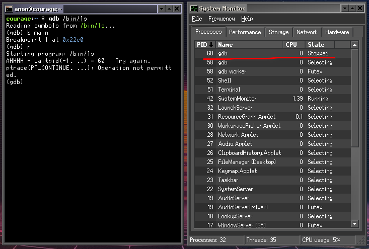

# Porting GDB to SerenityOS

## Introduction

While working on SerenityOS over the past few years, one of things I've missed
the most is a powerful debugger. For whatever reason [Andreas][kling] and most of the
other developers working on the system don't seem to be fans using a debuggers.
Now that I think about it, Andreas even has a video titled
["Why I don't use a debugger"][kling-no-debuggie] on his YouTube channel. 😁

[Itamar Shenhar][itamar-twitter] has been doing a bunch of work on Hack Studio,
and as part of that has implemented `ptrace(..)` and a basic debugger known as `sdb` (See [PR #1885][sdb-pr-initial]):

```
courage:~ $ sdb /bin/ls
Program is stopped at: 0x0bfae99d (Loader.so:ELF::DynamicLinker::linker_main() +0x5ed)
Source location: ./Userland/Libraries/LibELF/DynamicLinker.cpp:585

(sdb) help
Options:
cont - Continue execution
si - step to the next instruction
sl - step to the next source line
line - show the position of the current instruction in the source code
regs - Print registers
dis [number of instructions] - Print disassembly
bp <address/symbol/file:line> - Insert a breakpoint
bt - show backtrace for current thread
x <address> - examine dword in memory

(sdb) dis 1
    0x0bfae99d <+0>:
```

The debugger integration with `Hack Studio` and the standalone `sdb` debugger are great first passes at some
basic debugging infrastructure. During my time at Microsoft I have learned to love the debugger for root
causing complicated systems level bugs and even learning how a complex program works, there's no better tool in my
humble opinion. I think I would be a lot more productive working on Serenity if I had a more powerful debugger,
like `gdb`. So I decided to port the `GNU Project Debugger` to SerenityOS!

## Getting Things Compiling

The initial work to get the debugger to compile went smoothly. The work started in 
[PR #11278 - LibC+Ports: Add initial GDB 11.1 port][gdb-pr-initial].
I was able to quickly hack together build support for SerenityOS.
The gdb `configure` scripts were modified to enlighten them about the platform triplets (`i386-pc-serenity`, `x86_64-pc-serenity`), 

```diff
@@ -0,0 +1,55 @@
diff --git a/bfd/config.bfd b/bfd/config.bfd
index 30087e3..11dc114 100644
--- a/bfd/config.bfd
+++ b/bfd/config.bfd
@@ -634,6 +634,11 @@ case "${targ}" in
     targ_selvecs=
     targ64_selvecs=x86_64_elf64_vec
     ;;
+  i[3-7]86-*-serenity*)
+    targ_defvec=i386_elf32_vec
+    targ_selvecs=
+    targ64_selvecs=x86_64_elf64_vec
+    ;;
 #ifdef BFD64
   x86_64-*-cloudabi*)
     targ_defvec=x86_64_elf64_cloudabi_vec
@@ -694,6 +699,10 @@ case "${targ}" in
     targ_selvecs=i386_elf32_vec
     want64=true
     ;;
+  x86_64-*-serenity*)
+    targ_defvec=x86_64_elf64_vec
+    want64=true
+    ;;
 #endif
   i[3-7]86-*-lynxos*)
     targ_defvec=i386_elf32_vec
```

Both the `pthread_sigmask` and the pthread signal APIs were then disabled in gdb since
they were not implemented in the system at the time.

```diff
diff --git a/gdbsupport/configure b/gdbsupport/configure
index a9dd02c..3c5bcf5 100755
--- a/gdbsupport/configure
+++ b/gdbsupport/configure
@@ -8934,7 +8934,7 @@ $as_echo "$gdb_cv_cxx_std_thread" >&6; }

     # This check must be here, while LIBS includes any necessary
     # threading library.
-    for ac_func in pthread_sigmask pthread_setname_np
+    for ac_func in pthread_setname_np
 do :
   as_ac_var=`$as_echo "ac_cv_func_$ac_func" | $as_tr_sh`
 ac_fn_cxx_check_func "$LINENO" "$ac_func" "$as_ac_var"
diff --git a/libiberty/configure b/libiberty/configure
index fffb91d..defc239 100755
--- a/libiberty/configure
+++ b/libiberty/configure
@@ -6478,7 +6478,9 @@ case "${host}" in
     $as_echo "#define HAVE_SYS_ERRLIST 1" >>confdefs.h

     $as_echo "#define HAVE_SYS_NERR 1" >>confdefs.h
-
+    ;;
+  *-*-serenity*)
+    $as_echo "#define HAVE_PSIGNAL 1" >>confdefs.h
     ;;
 esac
```

The last thing holding us back from successfully compiling + linking gdb was that SerenityOS didn't implement `tcsendbreak(..)`
or `tcdrain(..)`. Fortunately we didn't have to worry about supporting real terminals so a [stub implementation
was sufficient for our purposes][libc-stubs].

```diff
From 99061e7af4f8f698c40581134633163d53f25a09
From: Brian Gianforcaro <bgianf@serenityos.org>
Date: Thu, 16 Dec 2021 04:24:25 -0800
Subject: LibC: Stub out tcsendbreak(..) and tcdrain(..)

They are required for gdb to build.
---
 Userland/Libraries/LibC/termios.cpp | 14 ++++++++++++++
 Userland/Libraries/LibC/termios.h   |  2 ++
 2 files changed, 16 insertions(+)

diff --git a/Userland/Libraries/LibC/termios.cpp b/Userland/Libraries/LibC/termios.cpp
index a6ca21243087f..291dafa65940f 100644
--- a/Userland/Libraries/LibC/termios.cpp
+++ b/Userland/Libraries/LibC/termios.cpp
@@ -30,6 +30,13 @@ int tcsetattr(int fd, int optional_actions, const struct termios* t)
     return -1;
 }
 
+// https://pubs.opengroup.org/onlinepubs/009695399/functions/tcsendbreak.html
+int tcsendbreak([[maybe_unused]] int fd, [[maybe_unused]] int duration)
+{
+    // FIXME: Implement this for real.
+    return 0;
+}
+
 int tcflow([[maybe_unused]] int fd, [[maybe_unused]] int action)
 {
     errno = EINVAL;
@@ -41,6 +48,13 @@ int tcflush(int fd, int queue_selector)
     return ioctl(fd, TCFLSH, queue_selector);
 }
 
+// https://pubs.opengroup.org/onlinepubs/009695399/functions/tcdrain.html
+int tcdrain([[maybe_unused]] int fd)
+{
+    // FIXME: Implement this for real.
+    return 0;
+}
+
 speed_t cfgetispeed(const struct termios* tp)
 {
     return tp->c_ispeed;
diff --git a/Userland/Libraries/LibC/termios.h b/Userland/Libraries/LibC/termios.h
index 752a2c7cbadf2..3a2382c7b9da2 100644
--- a/Userland/Libraries/LibC/termios.h
+++ b/Userland/Libraries/LibC/termios.h
@@ -10,8 +10,10 @@
 
 __BEGIN_DECLS
 
+int tcdrain(int fd);
 int tcgetattr(int fd, struct termios*);
 int tcsetattr(int fd, int optional_actions, const struct termios*);
+int tcsendbreak(int fd, int duration);
 int tcflow(int fd, int action);
 int tcflush(int fd, int queue_selector);
```

After putting all of these changes togeather we had the system building manually,
so we put together a `package.sh` file to automate compilation and installation of our gdb port:

```sh
#!/usr/bin/env -S bash ../.port_include.sh
port=gdb
version=11.1
useconfigure=true
configopts=("--target=${SERENITY_ARCH}-pc-serenity" "--with-sysroot=/" "--with-build-sysroot=${SERENITY_INSTALL_ROOT}" "--with-newlib" "--enable-languages=c,c++" "--disable-lto" "--disable-nls" "--enable-shared" "--enable-default-pie" "--enable-host-shared" "--enable-threads=posix")
files="https://ftpmirror.gnu.org/gnu/gdb/gdb-${version}.tar.xz gdb-${version}.tar.xz cccfcc407b20d343fb320d4a9a2110776dd3165118ffd41f4b1b162340333f94"
makeopts+=("all")
installopts=("DESTDIR=${SERENITY_INSTALL_ROOT}")
depends=("gmp" "binutils")
auth_type="sha256"

# We only have a stub of getrusage(..)
export ac_cv_func_getrusage=no

# We don't support the madvise options that are used.
export ac_cv_func_madvise=no
```

Much to my surprise, after building and installing the port, it actually kind of ran the first time I tried it!


As you can see the program does't seem to actually run, it just halts.

## Bonus Bug: Kernel Process Name after `PT_TRACE_ME`

After the initial port was compiling I started to debug what was wrong with out implementation that was
causing gdb to hang. If you looked at the processes under `System Monitor` you can see see that we have
two processes named `gdb`, one sitting `Suspended`, and one sitting `Selecting` which is serenity's way
of indicating a process is waiting for something.




```diff
diff --git a/Kernel/Syscalls/ptrace.cpp b/Kernel/Syscalls/ptrace.cpp
index 26d5d92e71..016007f97f 100644
--- a/Kernel/Syscalls/ptrace.cpp
+++ b/Kernel/Syscalls/ptrace.cpp
@@ -20,6 +20,7 @@ static ErrorOr<FlatPtr> handle_ptrace(const Kernel::Syscall::SC_ptrace_params& p
 {
     SpinlockLocker scheduler_lock(g_scheduler_lock);
     if (params.request == PT_TRACE_ME) {
+        dbgln("PT_TRACE_ME - caller({}) ", caller.pid());
         if (Process::current().tracer())
             return EBUSY;

@@ -49,6 +50,7 @@ static ErrorOr<FlatPtr> handle_ptrace(const Kernel::Syscall::SC_ptrace_params& p

     auto& peer_process = peer->process();
     if (params.request == PT_ATTACH) {
+        dbgln("PT_ATTACH - peer({}) caller({}) ", peer_process.pid(), caller.pid());
         if (peer_process.tracer()) {
             return EBUSY;
         }
@@ -62,8 +64,10 @@ static ErrorOr<FlatPtr> handle_ptrace(const Kernel::Syscall::SC_ptrace_params& p

     auto* tracer = peer_process.tracer();

-    if (!tracer)
+    if (!tracer) {
+        dbgln("ptrace - peer({}) has no tracer!", peer_process.pid());
         return EPERM;
+    }

     if (tracer->tracer_pid() != caller.pid())
         return EBUSY;
@@ -75,20 +79,24 @@ static ErrorOr<FlatPtr> handle_ptrace(const Kernel::Syscall::SC_ptrace_params& p

     switch (params.request) {
     case PT_CONTINUE:
+        dbgln("PT_CONTINUE - peer({}) caller({}) ", peer_process.pid(), caller.pid());
         peer->send_signal(SIGCONT, &caller);
         break;

     case PT_DETACH:
+        dbgln("PT_DETACH - peer({}) caller({}) ", peer_process.pid(), caller.pid());
         peer_process.stop_tracing();
         peer->send_signal(SIGCONT, &caller);
         break;

     case PT_SYSCALL:
+        dbgln("PT_SYSCALL - peer({}) caller({}) ", peer_process.pid(), caller.pid());
         tracer->set_trace_syscalls(true);
         peer->send_signal(SIGCONT, &caller);
         break;

     case PT_GETREGS: {
+        dbgln("PT_GETREGS - peer({}) caller({}) ", peer_process.pid(), caller.pid());
         if (!tracer->has_regs())
             return EINVAL;
         auto* regs = reinterpret_cast<PtraceRegisters*>(params.addr);
@@ -97,6 +105,7 @@ static ErrorOr<FlatPtr> handle_ptrace(const Kernel::Syscall::SC_ptrace_params& p
     }

     case PT_SETREGS: {
+        dbgln("PT_SETREGS - peer({}) caller({}) ", peer_process.pid(), caller.pid());
         if (!tracer->has_regs())
             return EINVAL;

@@ -114,16 +123,19 @@ static ErrorOr<FlatPtr> handle_ptrace(const Kernel::Syscall::SC_ptrace_params& p
     }

     case PT_PEEK: {
+        dbgln("PT_PEEK - peer({}) caller({}) ", peer_process.pid(), caller.pid());
         auto data = TRY(peer->process().peek_user_data(Userspace<const FlatPtr*> { (FlatPtr)params.addr }));
         TRY(copy_to_user((FlatPtr*)params.data, &data));
         break;
     }

     case PT_POKE:
+        dbgln("PT_POKE - peer({}) caller({}) ", peer_process.pid(), caller.pid());
         TRY(peer->process().poke_user_data(Userspace<FlatPtr*> { (FlatPtr)params.addr }, params.data));
         return 0;

     case PT_PEEKBUF: {
+        dbgln("PT_PEEKBUF - peer({}) caller({}) ", peer_process.pid(), caller.pid());
         Kernel::Syscall::SC_ptrace_buf_params buf_params {};
         TRY(copy_from_user(&buf_params, reinterpret_cast<Kernel::Syscall::SC_ptrace_buf_params*>(params.data)));
         // This is a comparatively large allocation on the Kernel stack.
@@ -142,11 +154,13 @@ static ErrorOr<FlatPtr> handle_ptrace(const Kernel::Syscall::SC_ptrace_params& p
     }

     case PT_PEEKDEBUG: {
+        dbgln("PT_PEEKDEBUG - peer({}) caller({}) ", peer_process.pid(), caller.pid());
         auto data = TRY(peer->peek_debug_register(reinterpret_cast<uintptr_t>(params.addr)));
         TRY(copy_to_user((FlatPtr*)params.data, &data));
         break;
     }
     case PT_POKEDEBUG:
+        dbgln("PT_POKEDEBUG - peer({}) caller({}) ", peer_process.pid(), caller.pid());
         TRY(peer->poke_debug_register(reinterpret_cast<uintptr_t>(params.addr), params.data));
         return 0;
     default:
```


[kling-no-debuggie]: https://www.youtube.com/watch?v=epcaK_bhWWA
[kling]: https://awesomekling.github.io/about/
[itamar-twitter]: https://twitter.com/ItamarShenhar 
[gdb-pr-initial]: https://github.com/SerenityOS/serenity/pull/11278
[sdb-pr-initial]: https://github.com/SerenityOS/serenity/pull/1885
[libc-stubs]: https://github.com/SerenityOS/serenity/pull/11278/commits/99061e7af4f8f698c40581134633163d53f25a09
[docs-gdb-tracing]: https://sourceware.org/gdb/current/onlinedocs/gdb/Debugging-Output.html#Debugging-Output 
